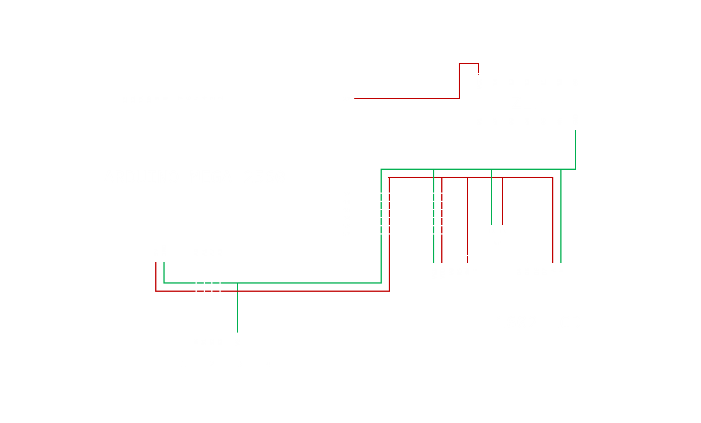

## LOGIX - IC Tester Documentation

**LOGIX** is designed to find issues in most of logical ICs in TTL/CMOS IC categories. LOGIX contains all the gate structures for each IC with thier pin types to test them anytime. Also this device will display all the logic gates in those ICs accoding to its graphical representation.

### Required Components

- Arduino MEGA 2560
- 14 Pin ZIF Socket
- 4 Push Buttons Keypad
- 1602A LCD Module
- 10k Ohm Potentiometer
- Jumper Wires
- Breadboard

### Circuit Diagram

### Source Structure

- **database**
    - `4000.h` - Contains IC data for CMOS series
    - `7400.h` - Contains IC data for TTL series
    - `imports.h` - Generates the complete database form each IC data file
- **display**
    - `symbols.h` - Contains custom characters for LCD
    - `modules.h` - Contains components for display methods
    - `methods.h` - Contains methods for LCD
- **inputs**
    - `methods.h` - Contains methods for user events
    - `checker.h` - Contains the inspector for user events
- **logical**
    - `methods.h` - Contains methods for logical checker
    - `checker.h` - Contains the IC testing module
- **tools**
    - `database_converter` - Converts database into compressed format using JSON
    - `lcd_char_generator` - Generates byte arrays for LCD custom characters
- **extern.h** - Containes function prototypes
- **setup.h** - Containes program pin indexes and other value definitions
- **logix.ino** - Main Program